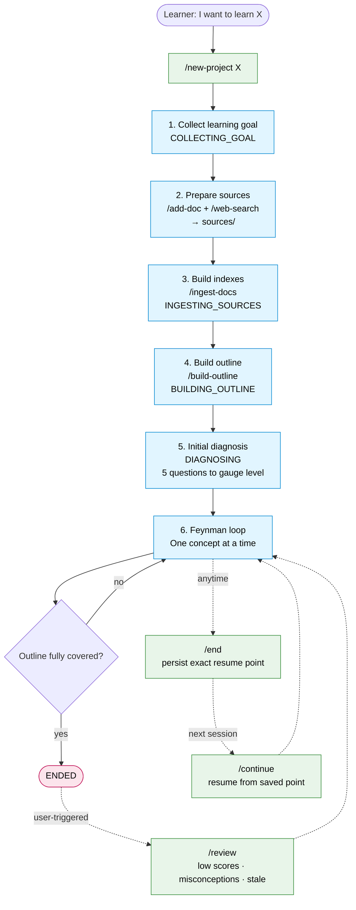
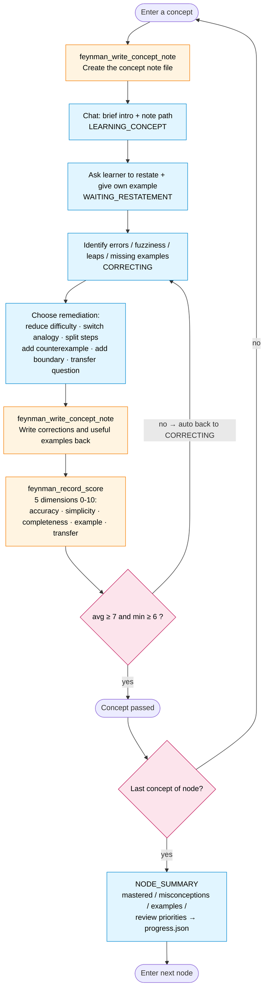

English | [Chinese (Simplified)](./README.zh-CN.md)

# Feynman Learning Pi Agent

A strict Feynman learning coach for [Pi Coding Agent](https://pi.dev/).

## Background

Feynman learning works because explaining in simple words exposes what you do not really understand. An LLM removes the need to find a listener: it is always available, patient, and able to challenge vague explanations. This agent turns that loop into a strict workflow: explain, get questioned, repair gaps, score, and only then move on.

Strictness matters because a default LLM can be too agreeable. It may say an unclear explanation is "well structured" instead of pressing on the weak parts. This agent defaults to a stricter coach mode: it looks for gaps, asks follow-up questions, and blocks progress until the concept passes.

This package turns Pi into a single-learner, multi-project learning coach that:

- creates persistent learning projects under `~/.pi/feynman-projects/`
- ingests Markdown learning materials
- searches the web with Tavily and stores search results as Markdown
- builds a learning outline from indexed sources
- diagnoses the learner before teaching
- teaches one small concept at a time
- saves a durable Markdown note for every taught concept
- requires restatement and learner-owned examples
- scores each concept before advancing
- enforces progress and score writes through dedicated Pi tools
- records detailed progress for continuation
- runs review only when the learner explicitly asks

## Agent Workflow

### Project lifecycle



### Per-concept Feynman loop



Orange blocks are mechanically enforced Pi tool calls, blue blocks are state machine nodes, pink blocks are decision gates, and green blocks are user command entry points. Full state rules live in the [`feynman-coach`](.pi/skills/feynman-coach/SKILL.md) skill.

## Requirements

- Node.js compatible with Pi Coding Agent
- Pi Coding Agent installed
- Tavily API key for web search

```bash
npm install -g @earendil-works/pi-coding-agent
export TAVILY_API_KEY="your_tavily_api_key"
```

## Install From GitHub

Install this package from GitHub:

```bash
pi install git:github.com/elowen53/feynman-learning
```

Or pin a tag:

```bash
pi install git:github.com/elowen53/feynman-learning@v0.1.0
```

You can also test a checkout directly:

```bash
pi install /absolute/path/to/feynman-learning
```

## Local Development

From this repository:

```bash
pi
```

Pi will auto-discover project-local resources in `.pi/`.

## Main Commands

Prompt templates:

- `/new-project <topic>`: create a new learning project
- `/add-doc <project> <path-to-md>`: add a Markdown source
- `/web-search <project> <query>`: ask the agent to search and save results
- `/ingest-docs <project>`: index Markdown sources
- `/build-outline <project>`: build or revise the learning outline
- `/start <project>`: start strict learning
- `/continue <project>`: continue from the saved node
- `/review <project>`: run user-triggered review
- `/status <project>`: show current learning state
- `/end <project>`: persist the exact continuation point

Extension command:

- `/feynman-search <project> <query>`: queue a Tavily search request

Use `/web-search` when you want the prompt template to guide the agent through the search workflow. Use `/feynman-search` when you want the extension command to queue a Tavily tool request directly.

Custom tools:

- `feynman_tavily_search`: searches Tavily and saves results to Markdown
- `feynman_write_concept_note`: writes the durable Markdown note for a concept
- `feynman_update_progress`: updates project progress with serialized file writes
- `feynman_record_score`: records scores and enforces the pass threshold
- `feynman_list_concepts`: queries `concept-notes/index.json` with filters so the agent only loads relevant entries
- `feynman_rebuild_concept_index`: rebuilds `concept-notes/index.json` from the note files and `reviews.json` when it drifts

The package also includes a protocol extension that appends the short `AGENTS.md` hard rules to Pi's system prompt when the package is installed globally or from GitHub. Detailed workflow rules live in the `feynman-coach` skill and are loaded by the prompt templates with `/skill:feynman-coach`. When you run Pi inside this repository, Pi may already load `AGENTS.md`; the extension avoids duplicating it.

## Strict Workflow Guarantees

`feynman_record_score` mechanically enforces the pass threshold: average score must be at least 7 and every dimension must be at least 6. If a concept does not pass, the tool moves the project state back to `CORRECTING`, so the agent must remediate before advancing. Full state rules live in the `feynman-coach` skill.

## Project Data Layout

Learner data is stored outside this repository:

```text
~/.pi/feynman-projects/<project>/
  project.json
  sources/
    user-docs/
    web/
  indexes/
    docs-index.md
    concepts-index.json
    source-map.json
  concept-notes/
  concept-notes/index.json
  outline.md
  progress.json
  reviews.json
  sessions/
```

Only Markdown sources are supported. Convert PDFs or other formats to Markdown before ingestion.

Concept notes are saved under:

```text
~/.pi/feynman-projects/<project>/concept-notes/<outline-node-slug>/<concept-slug>.md
```

They are the long-term knowledge base for taught concepts. The chat stays concise, while each note captures the explanation, definition, mechanism, examples, misconceptions, restatement task, and review questions.

`concept-notes/index.json` is the table of contents for these notes. `feynman_write_concept_note` and `feynman_record_score` keep it up to date with each concept's outline node, slugs, file path, `last_outcome` (`new` / `learning` / `remediating` / `passed`), last score summary, and active misconceptions. The agent uses `feynman_list_concepts` to query it with filters, and `feynman_rebuild_concept_index` to recover from drift after manual edits.

## Recommended Workflow

```text
/new-project llm
/add-doc llm /path/to/notes.md
/feynman-search llm "large language model fundamentals"
/ingest-docs llm
/build-outline llm
/start llm
```

At the end of a session:

```text
/end llm
```

Later:

```text
/continue llm
```

Review is explicit:

```text
/review llm
```

## Package Contents

- `AGENTS.md`: short hard-rule protocol for project-local use
- `.pi/extensions/feynman-protocol.ts`: injects short hard rules when used as a Pi package
- `.pi/extensions/feynman-state.ts`: concept note, progress, and score tools
- `.pi/skills/feynman-coach/SKILL.md`: reusable Feynman workflow skill
- `.pi/prompts/*.md`: command prompt templates
- `.pi/extensions/feynman-tavily.ts`: Tavily search extension
- `docs/pi-alignment-review.md`: Pi alignment review and optimization plan
- `docs/design.md`: design notes
