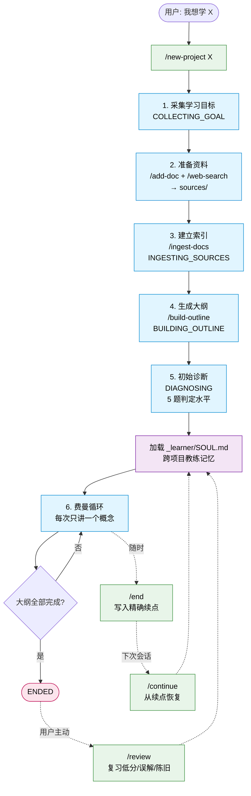
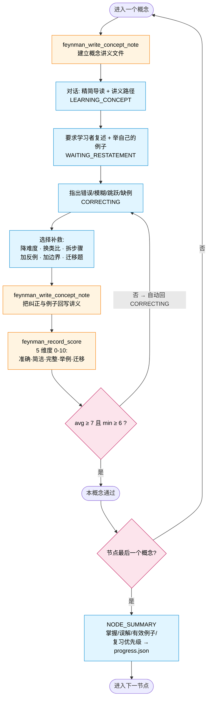

[English](./README.md) | 简体中文

# Feynman Learning Pi Agent

一个面向 [Pi Coding Agent](https://pi.dev/) 的严格费曼学习教练。

## 项目背景

费曼学习法的关键，是逼自己用最简单的话把概念讲清楚；讲不顺的地方，往往就是没真正懂的地方。LLM 解决了“没人可讲”的问题：它随时在线、有耐心，还能追问含糊处。这个项目把这件事做成严格闭环：讲出来、被追问、补漏洞、评分，通过后才继续。

严格很重要，因为默认的 LLM 往往太捧场。你讲得含糊，它也可能说“思路很清晰”，反馈价值会打折。本 agent 默认进入严格教练模式：主动找漏洞、追问不清楚的地方，没过评分门槛就不能继续推进。

它把 Pi 包装成一个单学习者、多项目并行的长期学习陪练：

- 在 `~/.pi/feynman-projects/` 下持久化每一个学习项目
- 把 Markdown 资料纳入索引
- 用 Tavily 搜索网络资料并存为 Markdown
- 基于索引生成可教学的大纲
- 正式开讲前先做水平诊断
- 每次只讲一个小概念
- 每个概念落地为一份长期复用的 Markdown 讲义
- 强制要求学习者复述并举自己的例子
- 每个概念必须通过评分门槛才能推进
- 进度与评分由专用 Pi 工具落盘，避免被遗忘
- 记录精确的续点，方便随时中断恢复
- 把有证据支撑的教练模式跨项目沉淀到 `_learner/SOUL.md`
- 复习只在用户主动请求时启动

## Agent 流程图

### 项目生命周期



### 单概念费曼循环



橙色块是机械强制的 Pi 工具调用，蓝色块是状态机节点，粉色块是判定门槛，绿色是用户命令入口，紫色块在每次进入费曼循环前加载跨项目教练记忆。完整状态规则见 [`feynman-coach`](.pi/skills/feynman-coach/SKILL.md) skill。

## 环境要求

- 与 Pi Coding Agent 兼容的 Node.js
- 已安装 Pi Coding Agent
- 用于网络搜索的 Tavily API key

```bash
npm install -g @earendil-works/pi-coding-agent
export TAVILY_API_KEY="your_tavily_api_key"
```

## 从 GitHub 安装

直接装最新版：

```bash
pi install git:github.com/elowen53/feynman-learning
```

锁定某个 tag：

```bash
pi install git:github.com/elowen53/feynman-learning@v0.1.0
```

也可以指向本地 checkout 测试：

```bash
pi install /absolute/path/to/feynman-learning
```

## 本地开发

在仓库根目录运行：

```bash
pi
```

Pi 会自动发现 `.pi/` 下的扩展、skill 和 prompt template。

## 主要命令

Prompt template：

- `/new-project <topic>`：创建新学习项目
- `/add-doc <project> <path-to-md>`：把 Markdown 资料加入项目
- `/web-search <project> <query>`：让 agent 走完整搜索流程
- `/ingest-docs <project>`：建立 Markdown 索引
- `/build-outline <project>`：生成或修订学习大纲
- `/start <project>`：开始严格学习
- `/continue <project>`：从上次保存的节点恢复
- `/review <project>`：用户主动触发的复习
- `/status <project>`：查看当前学习状态
- `/end <project>`：写入精确的续点

扩展命令：

- `/feynman-search <project> <query>`：直接排队一个 Tavily 搜索请求

`/web-search` 走 prompt template 引导 agent 完成搜索流程；`/feynman-search` 通过扩展命令直接调起 Tavily 工具，两者按需选用。

自定义工具：

- `feynman_tavily_search`：调用 Tavily 并把结果存成 Markdown
- `feynman_write_concept_note`：生成或更新概念讲义
- `feynman_update_progress`：以序列化写入更新项目进度
- `feynman_validate_transition`：写入进度前验证状态转移和 Pi 分支归属
- `feynman_record_score`：记录评分并强制通过门槛
- `feynman_update_coach_memory`：把有证据支撑的长期教练记忆追加到 `_learner/SOUL.md`
- `feynman_read_coach_memory`：读取长期教练记忆，用于跨项目个性化补救
- `feynman_retract_coach_memory`：撤回被证伪或过期的长期教练记忆，同时保留审计记录
- `feynman_list_concepts`：按 `outline_node` / `last_outcome` 等过滤条件查询 `concept-notes/index.json`，让 agent 只加载需要的 entry
- `feynman_rebuild_concept_index`：当索引和实际文件不一致时，从笔记文件和 `reviews.json` 重建

包内还有一个协议扩展：作为 Pi 包安装时，会把瘦身后的 `AGENTS.md` 硬规则注入 Pi 的系统提示。详细工作流写在 `feynman-coach` skill 中，由 prompt template 通过 `/skill:feynman-coach` 加载。在仓库内本地运行 Pi 时，Pi 可能已经加载过 `AGENTS.md`，扩展会跳过避免重复。

## 严格性保证

工具在以下情形会直接拒绝调用，agent 无法绕过：

- `feynman_record_score` 强制评分门槛：平均分必须 ≥ 7、单项必须 ≥ 6。不通过自动把项目状态改回 `CORRECTING`，必须先补救才能推进。
- `feynman_record_score` 拒绝 `learnerSummary` 缺失或少于 20 字符——必须先让学习者复述并把原话传进来。
- `feynman_record_score` 拒绝 `passed: true` 当概念讲义里没有 `### Update` 段——必须先调一次带 `learnerOutputAndCorrections` 的 `feynman_write_concept_note` 留下追问痕迹。
- `feynman_write_concept_note` 拒绝在同一大纲节点存在 `remediating` 概念时新开另一个概念——除非显式传 `force: true`（仅在学习者主动要求跳过时使用）。
- 会写入进度的 Feynman 工具会拒绝非法状态转移，也会拒绝来自非后代 Pi session branch 的写入。只有学习者明确选择让当前分支接管项目时，才使用 `branchMode: "adopt"`。
- `feynman_update_coach_memory` 拒绝无依据记忆：每条记录必须有具体证据，且需要学习者确认或至少两次独立观察。
- `feynman_read_coach_memory` 默认不返回已撤回记忆；撤回内容只留在 `SOUL.md` 中用于审计。

完整状态规则见 `feynman-coach` skill。

## 项目数据布局

学习项目数据存在仓库之外：

```text
~/.pi/feynman-projects/<project>/
  project.json
  sources/
    user-docs/
    web/
  indexes/
    docs-index.md
    concepts-index.json
    source-map.json
  concept-notes/
  concept-notes/index.json
  outline.md
  progress.json
  reviews.json
  sessions/
```

只支持 Markdown 资料。PDF 或其他格式需先转换为 Markdown 再导入。

概念讲义存在：

```text
~/.pi/feynman-projects/<project>/concept-notes/<outline-node-slug>/<concept-slug>.md
```

它们是已讲概念的长期知识库。聊天保持精简，每份讲义负责承载完整的解释、定义、机制、例子、误区、复述任务和检查题。

`concept-notes/index.json` 是这些讲义的目录索引。`feynman_write_concept_note` 和 `feynman_record_score` 会自动维护它：每条 entry 记录大纲节点、概念名、slug、文件路径、`last_outcome`（`new` / `learning` / `remediating` / `passed`）、最近一次评分摘要和未消除的误解。Agent 通过 `feynman_list_concepts` 按需查询，避免把整份索引拉进上下文；当索引与实际笔记文件失同步（手工编辑、改名、删除等）时，用 `feynman_rebuild_concept_index` 从笔记文件和 `reviews.json` 重建。

跨项目的教练记忆放在单独目录：

```text
~/.pi/feynman-projects/_learner/
  SOUL.md
```

`SOUL.md` 是 agent 在每次 `/start` 和 `/continue` 都会读取的长期教练记忆。它分 7 个类目记录有证据支撑的学习模式：稳定的学习偏好、反复出现的弱点、有效的补救策略、应避免的无效模式、评分校准注记、跨项目误解、教练自我修正。它**不是人格 prompt**：写入要么要学习者确认，要么需要至少 2 次独立观察加具体证据；被证伪的条目会被移入 `Retracted` 段，默认读取时不返回，但保留下来用于审计。

以下划线开头的目录名保留给系统数据（如 `_learner/`）。所有 Feynman 工具会拒绝以 `_` 开头的项目名。

## 推荐工作流

```text
/new-project llm
/add-doc llm /path/to/notes.md
/feynman-search llm "large language model fundamentals"
/ingest-docs llm
/build-outline llm
/start llm
```

会话结束：

```text
/end llm
```

下次继续：

```text
/continue llm
```

主动复习：

```text
/review llm
```

## 包内文件

- `AGENTS.md`：项目本地使用的简短硬规则
- `.pi/extensions/feynman-protocol.ts`：作为 Pi 包安装时注入硬规则
- `.pi/extensions/feynman-state.ts`：概念讲义、进度和评分工具
- `.pi/skills/feynman-coach/SKILL.md`：可复用的 Feynman 工作流 skill
- `.pi/prompts/*.md`：命令 prompt template
- `.pi/extensions/feynman-tavily.ts`：Tavily 搜索扩展
- `docs/pi-alignment-review.md`：Pi 对齐评审与优化方案
- `docs/design.md`：设计说明
